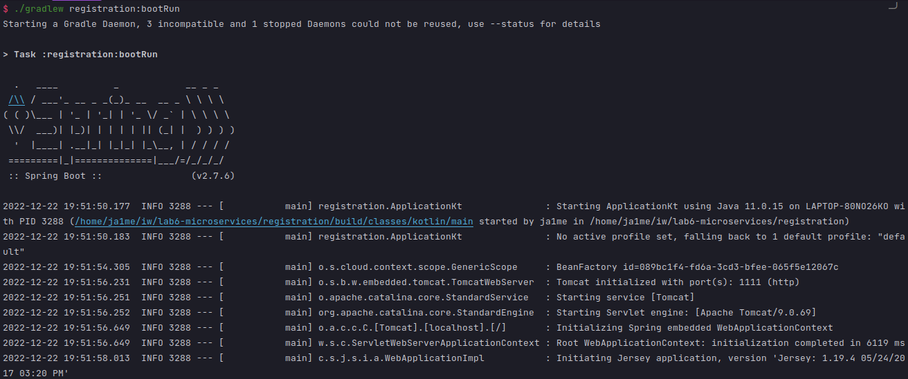

# REPORT.md

## TASKS TO DO

- Launch microservices
- Verify that an account service and a web service are running and registered on Eureka
- Launch 2 account services with different ports and a web service
- Kill an account service and do requests to web

### First Task: Launch microservices

- **Service discovery** (`registration` written in Kotlin):
  It launches an open source discovery server called [Eureka](https://github.com/Netflix/eureka) that will use the port 1111. The dashboard of the registration server is exposed in `http://localhost:1111`.

  ```bash
  ./gradlew registration:bootRun
  ```
  
    After that it's possible to observe something like the following pictures:
  
  

- **Account service** (`accounts` written in Kotlin):
  It is a standalone process that provides a RESTful server to a repository of accounts that will use the port 2222.
  What it makes special is that it registers itself to Eureka with the name `ACCOUNTS-SERVICE`. After launching this
  service you can see in the dashboard of Eureka that after a few seconds (10-20 secs) the `ACCOUNTS-SERVICE` service
  appears.

  ```bash
  ./gradlew accounts:bootRun
  ```

    After that it's possible to observe something like the following pictures:
    
    

- **Web service** (`web` written in Java):
  It is a standalone process that provides an MVC front-end to the application of accounts that will use the port 3333.
  What it makes special is that it registers itself to the Eureka with the name `WEB-SERVICE` and asks the Eureka where
  is the `ACCOUNTS-SERVICE`. Spring configures automatically an instance of `RestTemplate` for using the discovery
  service transparently!!!

  ```bash
  ./gradlew web:bootRun
  ```

    After that it's possible to observe something like the following pictures:
    
    

### Second Task: Verify that an account service and a web service are running and registered on Eureka

After launch all the servicies, at Eureka dashboard (on `http://localhost:1111`) appear that two different services are registered (an ACCOUNTS-SERVICE and a WEB-SERVICE), on that register it's also possible to see the ammount of instances of each service and their status.


### Third Task: Launch 2 account services with different ports and a web service

Before launch a new instance of account service it's mandatory to change the server port at application.yml, in that case the new port will be 4444. After that launch the service and check Eureka dashboard, now appear that exists two instances of account service (port 2222 and port 4444).


### Fourth Task: Kill an account service and do requests to web

First, stop one of the instances of accounts service, in this case the service at port 2222 was killed.
Then if we try to make a request with web service the response will be an 500 error.


But if we retry to make a request, in this case the response will be ok.


This happens because exists another account service (port 4444) that is registered at Eureka, when the first accounts service died and Eureka detects that it's impossible to connect with that instance, Eureka try to connect with the other instance registered, after that Eureka redirects the requests to the available service.